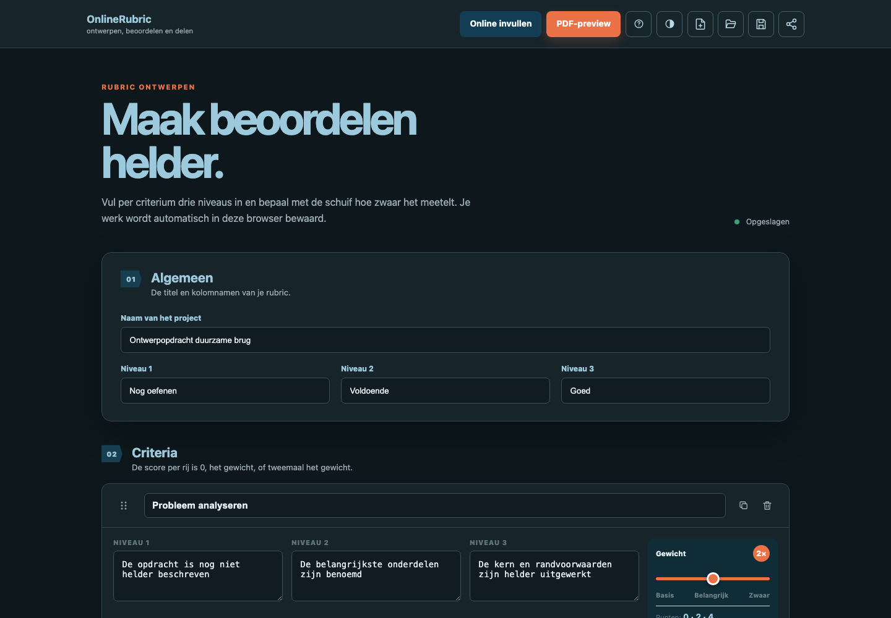
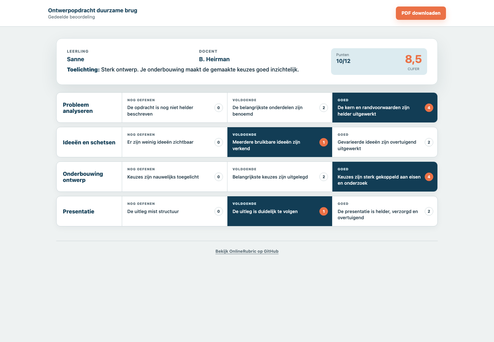

# OnlineRubric

**Rubrics ontwerpen, leerlingen beoordelen en heldere resultaten delen. Gewoon in je browser.**

[OnlineRubric openen](https://onlinerubric.nl/) · [Mogelijkheden](#mogelijkheden) · [Privacy](#privacygericht-ontworpen) · [Zelf gebruiken](#lokaal-gebruiken)

OnlineRubric is een Nederlandstalige webtool voor docenten. Je maakt er rubrics met drie prestatieniveaus mee, beoordeelt leerlingen online en genereert direct een printklare PDF. Er is geen account nodig en leerlinggegevens blijven lokaal in de browser.

## In beeld

### Een rubric ontwerpen

Criteria zijn eenvoudig te ordenen, te wegen en te voorzien van drie eigen prestatieniveaus.

### Een beoordeling delen

Een leerling krijgt via de deellink alleen de eigen, afgeronde beoordeling te zien. De gebruikte namen en inhoud in deze screenshots zijn fictief.

## Waarom OnlineRubric?

- **Privacygericht:** rubrics, leerlingnamen, beoordelingen, cijfers en opmerkingen blijven lokaal in de browser.
- **Direct bruikbaar:** geen account, installatie of database nodig.
- **Eén overzichtelijke werkwijze:** van rubricontwerp naar online beoordeling, leerlinglink en PDF.
- **Geschikt voor scherm en papier:** de invulweergave werkt responsief en de PDF is opgemaakt voor liggend A4.

## Mogelijkheden

- Rubrics maken met drie vrij benoembare prestatieniveaus
- Criteria toevoegen, dupliceren, verwijderen en verslepen
- Per criterium een gewicht van 1, 2 of 3 instellen
- Automatische puntentelling en omzetting naar cijfers van 1 tot en met 10
- Meerdere leerlingen binnen één klas of cluster beoordelen
- Een leerlinglijst afzonderlijk openen en opslaan
- Een complete klas met rubric en beoordelingen openen en opslaan
- Een rubric of ingevulde beoordeling delen via een zelfstandige deellink
- Eén leerling-PDF of alle voltooide PDF's als ZIP downloaden
- Een liggende A4-preview en printklare PDF genereren
- Lichte en donkere schermweergave
- Aangepaste bediening voor kleinere schermen

## Snel beginnen

1. Open [onlinerubric.nl](https://onlinerubric.nl/).
2. Geef de rubric een naam en benoem de drie prestatieniveaus.
3. Voeg criteria, omschrijvingen en eventuele weging toe.
4. Kies **Online invullen** om leerlingen te beoordelen of **PDF-preview** voor een papieren rubric.
5. Sla het werk lokaal op als `.rubric`-bestand of maak een deellink.

## Privacygericht ontworpen

OnlineRubric verwerkt de inhoud van rubrics en beoordelingen volledig in de browser. Rubrics, leerlingnamen, beoordelingen, cijfers en opmerkingen worden niet naar een OnlineRubric-database gestuurd. De beheerder van OnlineRubric kan deze gegevens niet inzien.

De toepassing gebruikt geen gebruikersaccounts, analytics, trackingcookies of externe scripts voor de werking van de app. Wijzigingen worden automatisch bewaard in de lokale browseropslag, vergelijkbaar met andere gegevens op een docentenlaptop.

De website draait als statische website op GitHub Pages. GitHub verwerkt bij het laden technische bezoekgegevens, waaronder het IP-adres, voor beveiligingsdoeleinden. GitHub ontvangt niet de inhoud van rubrics of beoordelingen.

Een collegadeellink bevat alleen het rubricontwerp. Een leerlingdeellink bevat uitsluitend de beoordeling van die ene leerling. De informatie is compact verwerkt in het gedeelte na het `#`-teken en wordt niet naar de webserver gestuurd. Behandel een leerlinglink daarom als een persoonlijk document en deel hem alleen met de bedoelde ontvanger.

## Bestanden openen en opslaan

Bij openen en opslaan kan worden gekozen uit drie varianten:

1. **Alleen rubric:** het rubricontwerp zonder leerlingen of beoordelingen.
2. **Alleen leerlinglijst:** de klas- of clusternaam en de namen van leerlingen, zonder rubric of beoordelingen.
3. **Alles:** de rubric, leerlinglijst en alle aanwezige beoordelingen.

Een afzonderlijke leerlinglijst wordt opgeslagen als `Leerlinglijst Klasnaam.rubric`. Alle `.rubric`-bestanden bevatten gewone JSON en oudere `.json`-exports kunnen nog steeds worden geopend. De klas- of clusternaam wordt alleen gebruikt voor lokale bestandsnamen en verschijnt niet in de rubric of PDF.

Chrome en Edge bieden waar mogelijk een bestandskiezer waarmee een locatie en bestandsnaam kan worden gekozen. In andere browsers wordt automatisch de normale downloadfunctie gebruikt.

## Lokaal gebruiken

Er is geen installatie of buildstap nodig. Open `index.html` rechtstreeks in een moderne browser. Voor gedrag dat een normale webomgeving vereist, kan de map ook via een eenvoudige lokale webserver worden geopend.

De toepassing bestaat uit gewone HTML, CSS en JavaScript. De benodigde PDF- en ZIP-bibliotheken staan lokaal in de map `vendor`, waardoor de kernfuncties niet afhankelijk zijn van externe diensten.

## Projectstructuur

- `index.html`: pagina's, bediening en dialoogvensters
- `styles.css`: schermweergave, responsive gedrag en printopmaak
- `app.js`: rubricbewerking, beoordelingen, import, export, delen en PDF-generatie
- `vendor/`: lokaal meegeleverde bibliotheken voor PDF- en ZIP-bestanden
- `docs/screenshots/`: productbeelden voor deze README

## Publiceren met GitHub Pages

De website kan rechtstreeks vanaf de hoofdbranch worden gepubliceerd:

1. Open in GitHub **Settings > Pages**.
2. Kies **Deploy from a branch**.
3. Selecteer de branch `main` en de repository-root `/`.
4. Sla de instelling op.

Omdat de toepassing statisch is, zijn geen buildcommando's of omgevingsvariabelen nodig. Het bestand `CNAME` koppelt de GitHub Pages-site aan [onlinerubric.nl](https://onlinerubric.nl/).

## Bijdragen

Problemen en verbetervoorstellen zijn welkom via [GitHub Issues](https://github.com/BjornB2/RubricGenerator/issues). Gebruik daarbij geen echte leerlingnamen, beoordelingen of leerlinglinks.

OnlineRubric is gemaakt door **Björn Heirman**, docent Onderzoek & Ontwerpen aan het Coornhert Lyceum in Haarlem. Contact: [bjorn@heirman.nl](mailto:bjorn@heirman.nl).

## Licentie

Copyright © 2026 Björn Heirman.

OnlineRubric is vrije software onder de **GNU Affero General Public License, versie 3 of later** (`AGPL-3.0-or-later`). Commercieel gebruik is toegestaan. Wie een aangepaste versie verspreidt of via een netwerk beschikbaar stelt, moet de bijbehorende broncode onder dezelfde licentie beschikbaar maken. Zie [`LICENSE`](LICENSE) voor de volledige voorwaarden.

De afzonderlijke bibliotheken in `vendor/` blijven onder hun eigen licentievoorwaarden vallen.
